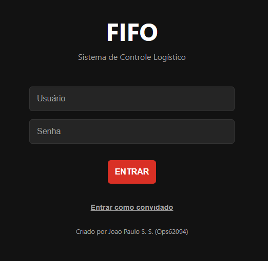
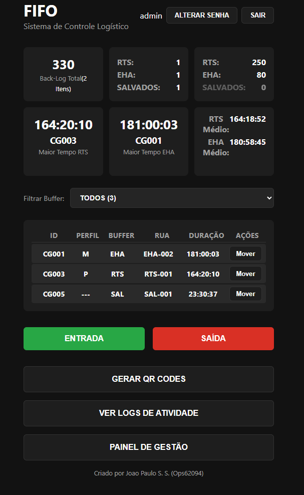
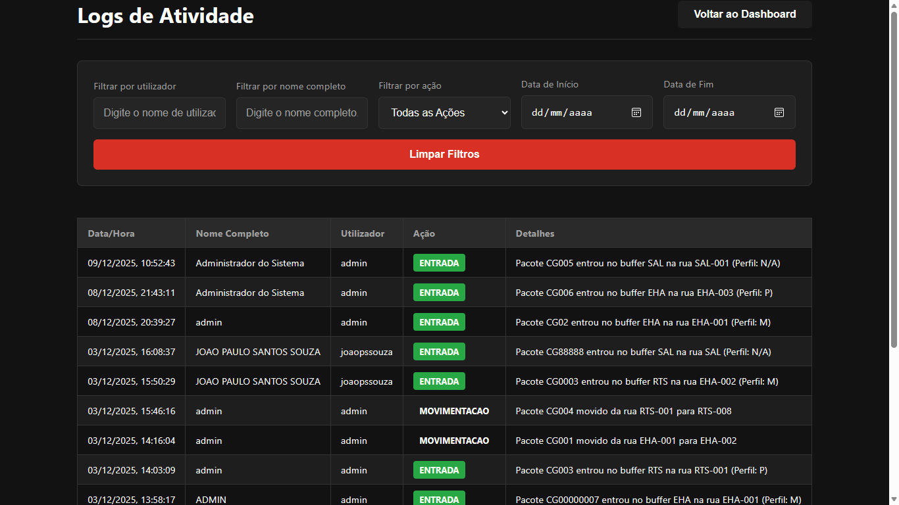
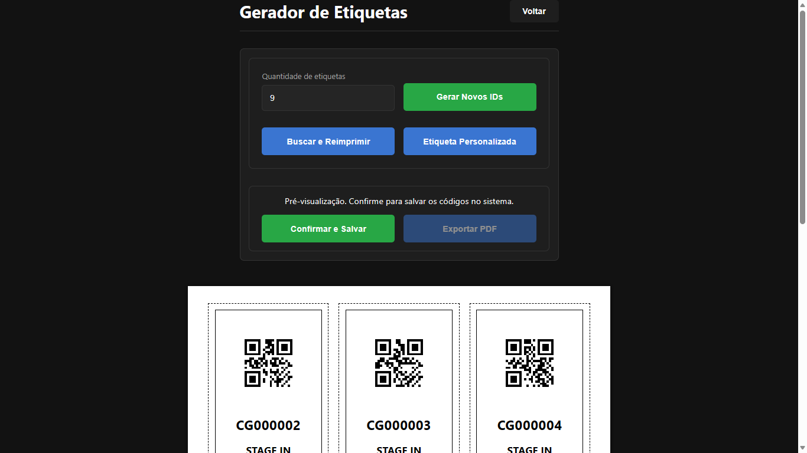
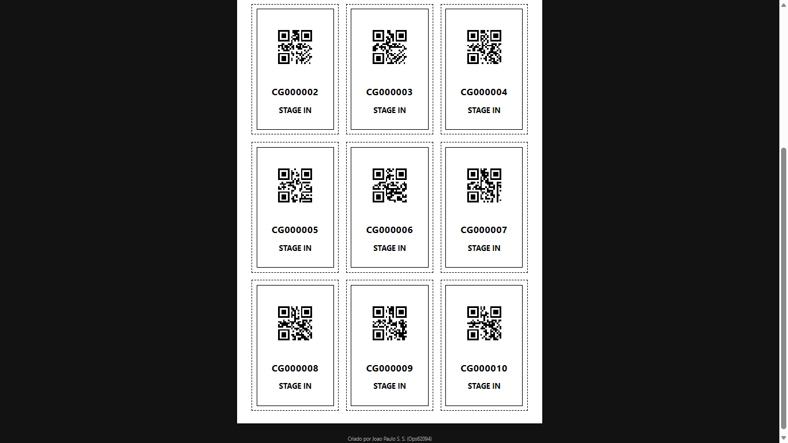
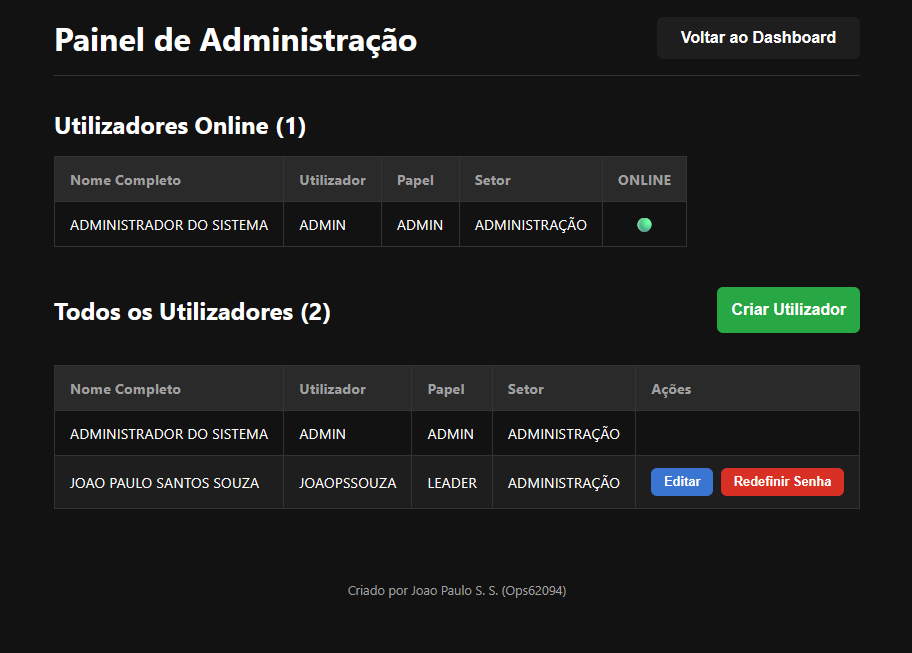

# FIFO System - Sistema de Controle Logístico

<p align="center">
  
  
</p>
<p align="center">
  <em>Acesso Seguro (Desktop) e Monitoramento em Tempo Real (Mobile)</em>
</p>

Sistema de gestão logística de alta performance focado na metodologia **FIFO (First-In, First-Out)**. A aplicação gerencia o fluxo de entrada e saída de pacotes, rastreamento via QR Code, monitoramento em tempo real e auditoria completa de operações.

Este projeto foi modernizado para uma arquitetura **Enterprise** utilizando **Java 21** e **Spring Boot 3**, garantindo escalabilidade, segurança e manutenibilidade.

---

## 🚀 Stack Tecnológica

O projeto adota as práticas de mercado mais recentes para desenvolvimento de software corporativo.

### **Backend (API RESTful)**

  * **Linguagem:** Java 21 LTS
  * **Framework:** Spring Boot (Starter Parent 4.0.0)
  * **Segurança:** Spring Security 6 + JWT (JSON Web Token) com criptografia BCrypt
  * **Banco de Dados:** PostgreSQL
  * **Migração de Dados:** Flyway (Versionamento de Schema)
  * **Documentação:** SpringDoc OpenAPI (Swagger UI)
  * **Comunicação Real-Time:** Spring WebSocket

### **Frontend (SPA)**

  * **Framework:** React 19
  * **Build Tool:** Vite 7
  * **Roteamento:** React Router DOM
  * **HTTP Client:** Axios (com interceptors para Auth)
  * **Utilitários:** QRCode.react (Geração de QR), jsPDF (Exportação de relatórios)

### **DevOps & Infraestrutura**

  * **Containerização:** Docker & Docker Compose (Multistage Build)
  * **CI/CD:** GitHub Actions (Pipelines separadas para Backend e Frontend)
  * **Servidor Web:** Nginx (Reverse Proxy para o Frontend)

-----

## 📖 Documentação da API (Swagger/OpenAPI)

A API do sistema é totalmente documentada e interativa, seguindo o padrão **OpenAPI 3.0**. O backend expõe uma interface Swagger UI que permite testar endpoints, visualizar esquemas de dados (DTOs) e entender os requisitos de autenticação.

### Acesso à Documentação

Após iniciar a aplicação (via Docker ou localmente), a documentação estará disponível em:

👉 **[http://localhost:8080/swagger-ui/index.html](http://localhost:8080/swagger-ui/index.html)**

### Funcionalidades Documentadas:

1.  **Autenticação (`/api/auth`):** Endpoint de login que retorna o Token JWT necessário para todas as outras requisições. Use o botão **Authorize** no topo do Swagger para injetar o token.
2.  **Gestão de Pacotes (`/api/packages`):** Operações de entrada (`POST`), saída (`DELETE`) e movimentação interna (`PUT`) de itens.
3.  **Auditoria (`/api/management/logs`):** Consulta de histórico de operações com filtros dinâmicos (por usuário, data, ação).
4.  **Dashboard (`/api/dashboard`):** Endpoints de leitura otimizados para métricas em tempo real e estatísticas de backlog.
5.  **Administração (`/api/management/users`):** CRUD completo de usuários e gestão de permissões (RBAC).

-----

## 🏛️ Arquitetura e Decisões Técnicas

O sistema foi desenhado com foco em desacoplamento e robustez:

  * **Clean Architecture:** Separação clara entre Entidades de Domínio, Repositórios (Interface com o banco) e Serviços (Regras de Negócio), garantindo que a lógica FIFO não seja contaminada por detalhes de infraestrutura.
  * **Database as Code:** O estado do banco é gerenciado estritamente via código. Nenhuma tabela é criada manualmente; o **Flyway** executa scripts SQL versionados (`V1__...`, `V2__...`) a cada deploy, garantindo integridade entre ambientes.
  * **Soft Deletes & Auditoria:** Dados nunca são perdidos. A exclusão de pacotes é lógica (`deleted_at`), e um serviço de auditoria independente registra "quem", "quando" e "o quê" em cada transação.

-----

### Galeria de Funcionalidades

| Gestão de Logs e Auditoria | Gerador de Etiquetas QR Code |
|:--------------------------:|:----------------------------:|
|  |  |
| *Rastreabilidade completa de ações* | *Geração e impressão de etiquetas em PDF* |

| Preview de Impressão | Painel Administrativo |
|:--------------------:|:-------------:|
|  |  |
| *Layout A4 para etiquetas físicas* | *Gestão de usuários e permissões (RBAC)* |

## 🚀 Como Executar o Projeto

### Pré-requisitos

  * Docker e Docker Compose instalados.

### Passo a Passo

1.  **Clone o repositório:**

    ```bash
    git clone [https://github.com/joaopssouza/fifo-system-java.git](https://github.com/joaopssouza/fifo-system-java.git)
    cd fifo-system-java
    ```

2.  **Configure o Ambiente:**
    Crie o arquivo `.env` na pasta `backend` (use o `.env.example` como base).

3.  **Suba os Containers:**

    ```bash
    docker-compose up --build
    ```

4.  **Acesse:**

      * **Aplicação:** [http://localhost:5173](http://localhost:5173)
      * **Swagger API:** [http://localhost:8080/swagger-ui/index.html](http://localhost:8080/swagger-ui/index.html)

### Credenciais Iniciais

O sistema cria automaticamente um usuário administrador na primeira execução:

  * **Usuário:** `admin`
  * **Senha:** `admin`

> **Nota:** Recomenda-se alterar a senha no primeiro acesso através do painel de perfil.

-----

## 🧪 Qualidade e Testes

O projeto conta com pipelines de CI/CD configuradas via GitHub Actions para garantir a qualidade do código a cada push:

  * **Backend:** Execução de testes unitários com JUnit 5 e Mockito para validar regras de negócio críticas (ex: unicidade de Tracking ID).
  * **Frontend:** Verificação de Linting (ESLint) e Build de produção para assegurar a integridade da interface.

Para rodar os testes localmente:

```bash
cd backend
./mvnw test
````

-----

**Desenvolvido por João Paulo S. Souza**